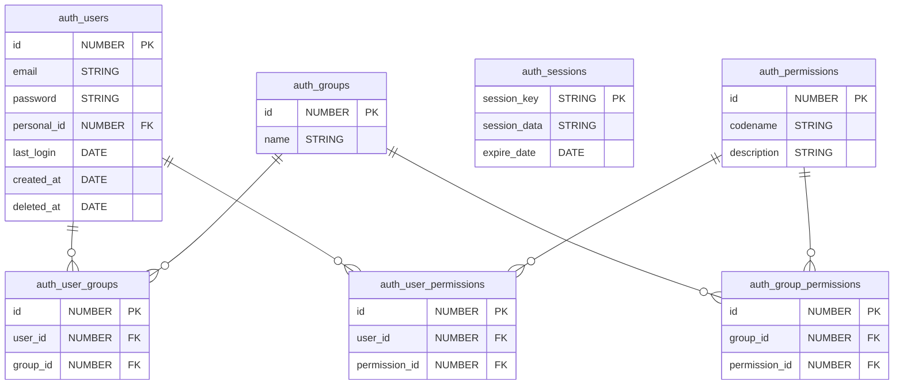

# Auth Database Diagram

```mermaid
erDiagram
    auth_users {
        id NUMBER PK
        email STRING
        password STRING
        personal_id NUMBER FK
        last_login DATE
        created_at DATE
        deleted_at DATE
    }

    auth_groups {
        id NUMBER PK
        name STRING
    }

    auth_sessions {
        session_key STRING PK
        session_data STRING
        expire_date DATE
    }

    auth_permissions {
        id NUMBER PK
        codename STRING
        description STRING
    }

    auth_user_groups {
        id NUMBER PK
        user_id NUMBER FK
        group_id NUMBER FK
    }

    auth_user_permissions {
        id NUMBER PK
        user_id NUMBER FK
        permission_id NUMBER FK
    }

    auth_group_permissions {
        id NUMBER PK
        group_id NUMBER FK
        permission_id NUMBER FK
    }

    auth_users ||--o{ auth_user_groups : ""
    auth_groups ||--o{ auth_user_groups : ""

    auth_users ||--o{ auth_user_permissions : ""
    auth_permissions ||--o{ auth_user_permissions : ""

    auth_groups ||--o{ auth_group_permissions : ""
    auth_permissions ||--o{ auth_group_permissions : ""
```
